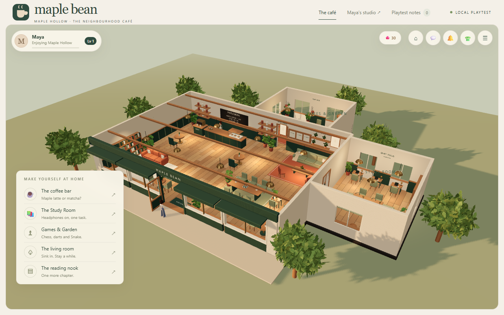
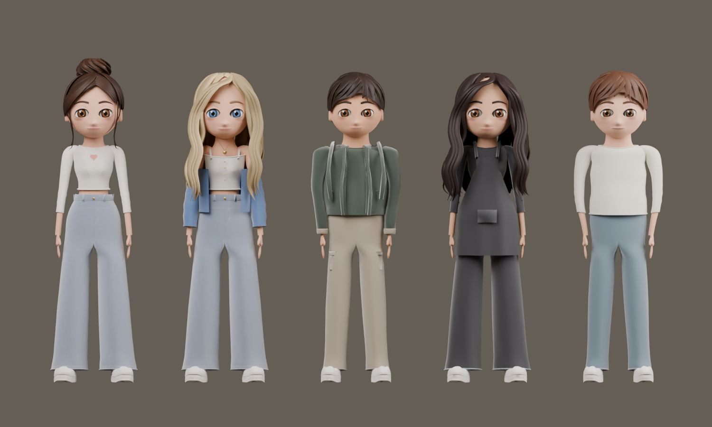

# 🍁 Maple Bean

**Coffee · People · Stories**  
*A little room to slow down.*

Maple Bean is a cozy 3D browser game set in a neighborhood café in Maple Hollow. Create a character, meet the regulars, order a drink, study, play games, and make the space feel like your own.

The concept is a digital third place: somewhere between home and work where small routines, familiar faces, and good company give you a reason to return.

[Play the private hosted café](https://maple-bean-cafe-aymen.peterhaddad200697049.chatgpt.site)

> The hosted edition is a solo experience requiring the owner's account. The local edition also supports experimental guest multiplayer. This is a playable prototype, not a finished commercial release.

## Inside the café



*Development capture showing the main café, Study Room, and Games & Garden. Some details differ from the latest build.*

Warm wood, deep green, cream walls, brass accents, leafy plants, and soft lighting define Maple Bean's style. The café and stylized characters follow the supplied visual references.

Explore the coffee bar, shared tables, fireside lounge, reading nook, window seating, study room, and games area. Activities happen inside the world: sit at a chair, order at the counter, study at a desk, or play at a table.

## Meet the cast



*Latest character lineup rendered in Blender. In-game lighting changes their appearance.*

| Character | Personality | Signature look |
| --- | --- | --- |
| Maya — The Optimist | Friendly, warm, creative | Brown bun, cream heart top, wide-leg jeans |
| Claire — The Dreamer | Kind, elegant, thoughtful | Blonde waves, blue cardigan, light denim |
| Noah — The Chill One | Calm, friendly, reliable | Dark hair, green hoodie, sand trousers |
| Mara — The Bold One | Confident, stylish, ambitious | Long dark hair and a charcoal café outfit |
| Jules — The Creative One | Chill, funny, artistic | Short brown hair, cream top, blue trousers |

The approved character style is locked. Recent polish extends the men's tops below the waist, corrects walking arm swing, smooths expressions, and coordinates blinking. Characters use skeletal animation and facial morph targets, with poses for café interactions.

## Gameplay

- **Explore:** walk around furniture, choose destinations, sit, read, wave, and use highlighted objects.
- **Enjoy coffee:** order coffee, latte, or matcha; collect your drink and take a sip.
- **Focus:** choose a study session, pause and resume, listen to ambient music, or study beside a regular.
- **Play:** try Chess, XO, Memory, Maple Eights, Snake, and Darts.
- **Connect:** chat with regulars, give gifts, build friendships, and invite characters to activities.
- **Customize:** use the character creator and wardrobe to change your avatar's appearance and clothing.
- **Progress:** earn Maple Coins and XP through supported activities, unlock clothing, and build study streaks.
- **Review:** inspect characters in Maya's Studio and record or export playtest notes.

The core loop: **arrive → choose an activity → spend time with the café community → earn progress → return when you want a break.**

## Tools and technology

| Tool | Role |
| --- | --- |
| Three.js | Real-time 3D rendering, cameras, materials, and character display |
| JavaScript, HTML, CSS | Gameplay and responsive browser interface |
| Node.js | Local server, guest sessions, chat, and multiplayer coordination |
| Blender 5.2 | Modeling, rigging, editable scenes, and renders |
| Python + Blender API | Repeatable asset refinement and export scripts |
| glTF / GLB | Delivery format for browser-ready 3D assets |
| Anthropic SDK | Optional AI dialogue in the local server edition |
| Node test runner | Gameplay, navigation, asset, and animation checks |
| Playwright | Browser QA and development screenshots |
| OpenAI Codex | Assisted development and specialist refinement |
| Sites | Private hosting for the static solo edition |

The browser game uses Three.js directly; Unity and Unreal Engine are not required.

## Run locally

Install a current Node.js LTS release. From the project folder:

```sh
npm install
npm start
```

Open [the local café](http://localhost:4321) and keep the server terminal open. On Windows, `Start Cafe.cmd` is an alternative launcher once dependencies are installed.

Open [Maya's Studio](http://localhost:4321/maya.html) to inspect the cast, poses, and expressions.

`localhost` means the device opening the link. Use the hosted café link on a phone; the local server binds to `127.0.0.1` by default.

### Controls

| Input | Action |
| --- | --- |
| WASD / arrow keys | Walk |
| Click clear floor | Walk to a point |
| Click a highlighted object | Show available interactions |
| E | Interact or get up |
| Esc | Cancel a route or leave an action where supported |
| F | Wave |
| Drag / mouse wheel | Orbit / zoom the camera |
| Touch interface | Tap available controls and interactions |

## Editions and saved progress

| Feature | Hosted solo café | Local server |
| --- | --- | --- |
| Café, cast, activities, and games | Included | Included |
| Scripted NPC conversations | Included | Included |
| Optional AI conversations | Not enabled | With server credentials |
| Guest multiplayer and nearby player chat | Not included | Experimental |
| Browser-saved profile and progress | Per browser | Per browser |

Local AI dialogue can use `ANTHROPIC_API_KEY` configured in the server environment. Without credentials, regulars use authored persona replies. Keep credentials out of client files and version control.

Saved progress uses browser storage and does not automatically sync across devices. Guest sessions are temporary. Maple Coins are in-game progression; no real-money purchasing is connected.

## Project structure

```text
assets/characters/      Character models and runtime posing
assets/cafe.glb         Exported café geometry
assets/layout.json     Seats, interactions, navigation boundaries
assets/visual-world.js Runtime plants, materials, and visual details
games/                 Mini-game rules
systems/               Creator, lighting, rewards, supporting systems
tools/                 Blender scripts, exports, release preparation
tests/                 Automated checks
qa/                    Browser QA scripts and evidence
refinement/            Refinement scenes, renders, and reports
docs/images/           README images
web-release/           Hosted solo edition
app.js                 Main game integration
server.mjs             Local server and multiplayer services
MapleBeanExpanded.blend Editable café source scene
```

The browser scene combines exported geometry with runtime additions. Opening the café Blender file alone does not reproduce every browser detail.

## Validation and status

Run automated checks:

```sh
npm test
```

Some integration checks require the local server. Browser smoke checks are available through `npm run qa:smoke` with a compatible browser setup.

The latest character pass passed 10 targeted checks covering asset budgets, expressions, blinking, palms, walking counter-swing, and preserved seated/cup poses. This does not certify every pose or device. Further fixes should address specific clipping, interaction, performance, or accessibility issues while preserving the approved visual style.

**A cup of coffee, a familiar face, and a little time for yourself.**
